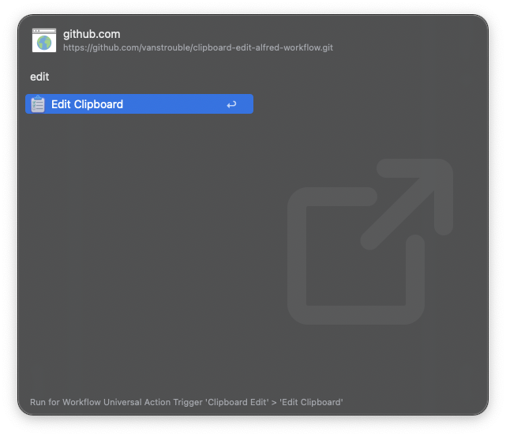

#  Clipboard Edit | Alfred Workflow

Edit clipboard text with Alfred and paste it instantly into the frontmost app.

## Download

- You can also download it directly from GitHub [here](https://github.com/vanstrouble/clipboard-edit-alfred-workflow.git/releases/latest).

## Usage

List the Alfred Clipboard, via Universal action type `edit`.

- <kbd>↩</kbd> Add to the clipboard list items.
- <kbd>↩</kbd><kbd>⌘</kbd> Paste it into the frontmost app.
